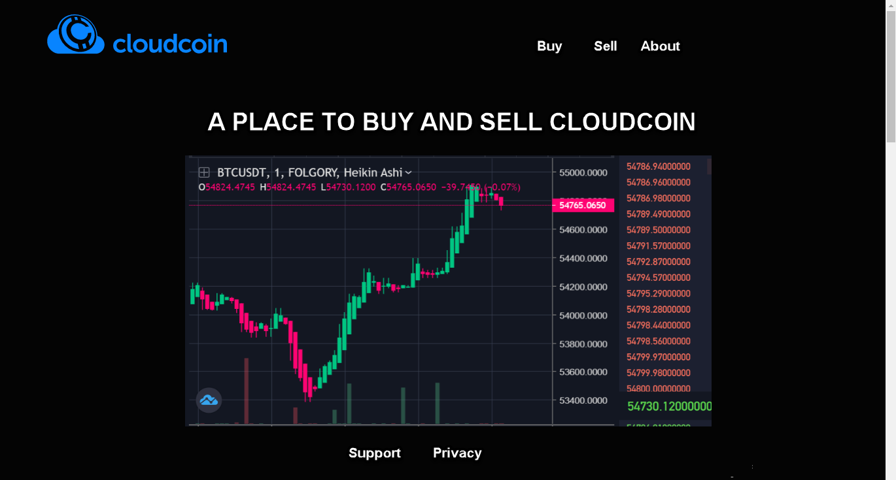
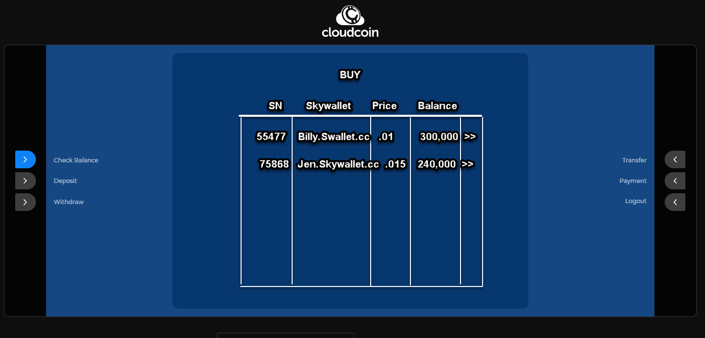
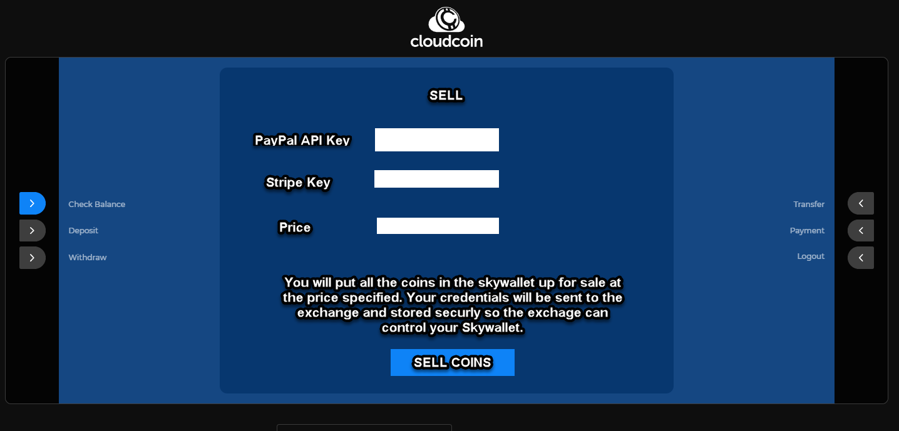

# Exchange
Place to Buy and Sell CloudCoin


The Exchanges is composed of Three Parts:

[Marketing Page](README.md#marketing-page)

[Skywallet ATM additions](README.md#skywallet-atm-additions)

[CloudCoin](README.md#marketing-page)

# Marketing Page
Page | Purpose | Description
-----|----|-------
index.html | Shows Sales Chart | This page has the Nav Bar, Bottom Contact Page, Title and Sales Activity Chart
buy.html | Helps people buy CC | This page has a video that shows how to use the Skywallet to buy coins. 
sell.html | Helps people sell CC | This page has a video that shows how to use the Skywallet to sell coins. 
about.html | Tells user about the site | Video explaination and some text explanation
privacy.html | Privacy Policy |Tells the user that no cookies are collected

### Index Mockup


## Services
### Report Sales
The Marketing Page has one service called "Report Sales". Approved exchanges can use this service. 
```
https://Theexchange.com/service/report.php?price=88&volumn=88&seller_sn=9934343&seller_address=bill.skywallet.cc&buyer_sn=888763&buyer_address=sean.cloudcoin.global&exchange=main&payment=paypal
```
### View Sales
This allows other web pages to subscript to the sales feed. 
SAMPLE REQUEST:
```url
https://something.com/serv/view_sales.php?limit=100&start_date=4.20.21
```
SAMPLE RESPONSE:
```json
{
  "invoiceTime": "2018-12-10T13:49:51.141Z",
  "total": 336,
  "payment_method":"paypal",
  "buyer_name":"jerry.skywallet.cc",
  "buyer_sn":754455,
  "seller_name":"linda.skywallet.cc",
  "seller_sn":"885552",
  "price": 445,
  "currency":"usd",
  "view_receipt":"7c76119b7bba4ea38dc13ef490f4c9da",
  "notes":"unsynced"
  },
{
  "invoiceTime": "2018-12-10T13:49:51.1500",
  "total": 336,
  "payment_method":"paypal",
  "buyer_name":"glenn.skywallet.cc",
  "buyer_sn":64455,
  "seller_name":"terry.skywallet.cc",
  "seller_sn":"235552",
  "price": 445,
  "currency":"usd",
  "view_receipt":"7c76119b7bba4ea38dc13ef490f4c9da",
  "notes":"perfect"
  }
```


# Skywallet Additions
Menu Item | Purpose | Explanation
----|-----|--------
Buy | Buy CC | Shows list of sellers that the buyer can click on 
Sell | Sell CC | Allows user to enter their sales information

### Mockup of Buy Screen


### Mockup of Sell Screen



# Exchange_Manager
The Exchange Manager is a program that runs on a server and veryifies payments, controls transfers, reports activity and more. 
Feature | Explanation
------ | ----------
Store Skywallet Password | Stores sensitive information in its RAM. If the server goes down, the users will need to re-enter the info. 
Store PayPal API Key | Stores the PayPal API key in RAM to keep it safe. 
Store Stripe API Key | Stores the Strip API key in RAM to keep it safe. 
Stores Seller info | Again in RAM, Skywallet Address, Serial Number, Price, Balance. This information can be created, updated, read and deleted. Date entered
Transfers CC | Transfer's CloudCoins when commanded by a PHP page. 
Checks Balance | Every five minutes, it will query the balances of the wallets it has 
Reports on Transfers | Sales and volumn sent to the Marketing server. 
Provides For Sale Report | Allows buyers to see top sales accounts. 


### Create Sale Order (also used to change)
SAMPLE GRPC REQUEST:
```GPRC
message sale_order {
  required int32 price = 1;
  required int32 sn  = 2;
  required string name = 3;
  required string password = 4;
  optional string paypal_key = 5;
  optional string stripe_key = 6;
}
```
SAMPLE GRPC RESPONSE:
```
success
```

### Delete Sale Order
SAMPLE GRPC REQUEST:
```GPRC
message delete {
  required int32 sn = 1;
}
```
SAMPLE GRPC RESPONSE:
```
success
```

### Seller Report
SAMPLE GRPC REQUEST:
```GPRC
  message sales_report {
  required int32 limit = 1;
  optional string order_by = 2;
}
```
SAMPLE GRPC RESPONSE:
```
{
  "price":.015,
  "sn":85554,
  "skywallet":"jerry.skywallet.cc
},
{
  "price":.01,
  "sn":5545589,
  "skywallet":"bill.skywallet.cc
}
```


